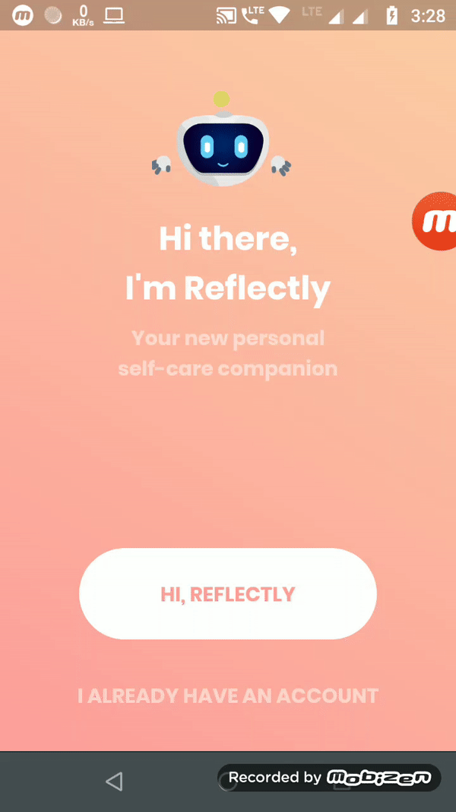
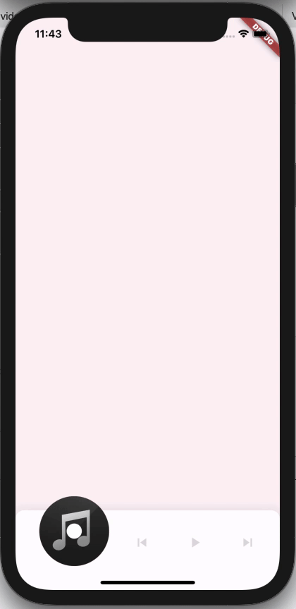
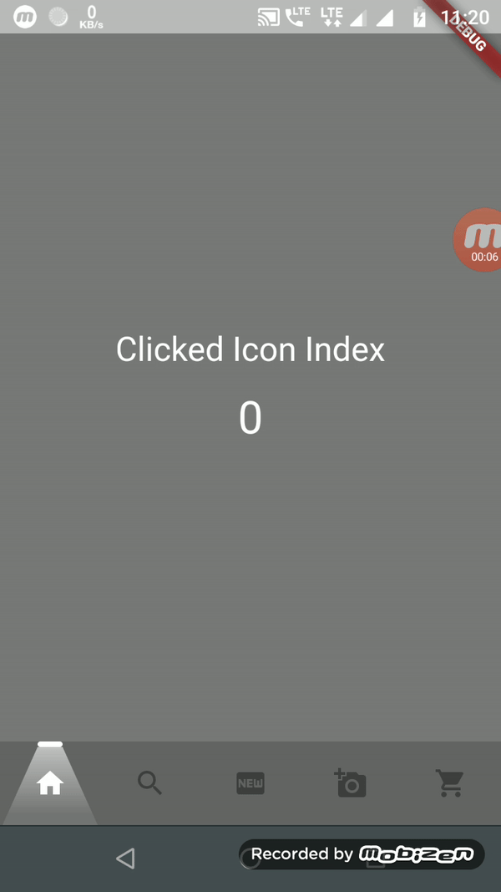
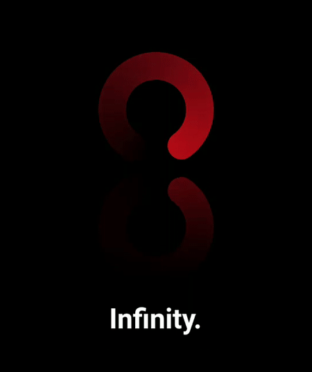

Hi there 👋

My name is Akhil Soman. 
I am a mobile application developer with 6+ years of experience with working with Android(5 Years) and Flutter(~2 Years).

You can view my [portfolio site](https://akhilsomanvs.github.io/#/)(Not responsive)

Some of the UIs that I created with Flutter are shown below.

[Reflectly Clone](https://github.com/akhilsomanvs/flutter_reflectly_clone)

[Music Player](https://github.com/akhilsomanvs/music_player)

[LightCone BottomBar UI](https://github.com/akhilsomanvs/flutter_LightConeBottomBarUI)

[Mirrored Loading UI](https://github.com/akhilsomanvs/flutter_mirrored_loading_ui)

git 

<!--
**akhilsomanvs/akhilsomanvs** is a ✨ _special_ ✨ repository because its `README.md` (this file) appears on your GitHub profile.

Here are some ideas to get you started:

- 🔭 I’m currently working on ...
- 🌱 I’m currently learning ...
- 👯 I’m looking to collaborate on ...
- 🤔 I’m looking for help with ...
- 💬 Ask me about ...
- 📫 How to reach me: ...
- 😄 Pronouns: ...
- ⚡ Fun fact: ...
-->
